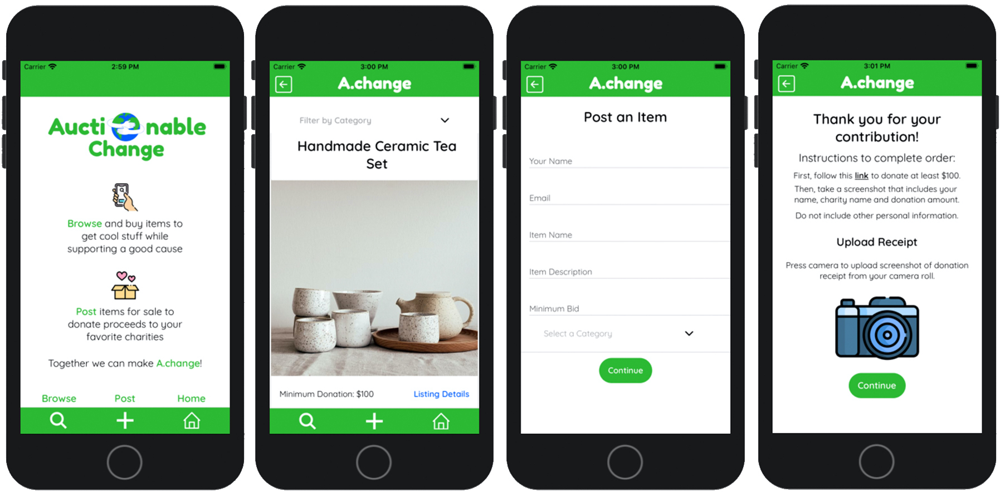

### Together we can make **A.change**! 

##  Description
**Auctionable Change** is a cross-pollination capstone project for [Turing School of Software and Design](https://turing.io/).
The idea behind **A.change** is supporting charities and the planet by reselling items and buying secondhand.
Sellers can post items, set a minimum price and select a charity to which the funds from that item's sale will be donated. 
Buyers browse items and purchase by donating to selected charity. 
Buyers notify sellers through app generated email with proof of donation and shipping information.

## Local Setup Instructions
- Fork and clone this repo to your local machine using SSH: `git clone git@github.com:Auctionable-Change/auctionable_change.git`
- Navigate to the new directory: `cd auctionable_change`
- Download [Expo Client](https://expo.io/tools#client) to open the app from your iOS device.
- Run `npm start` then scan the QR code with the Camera app to open.
- Sorry, Android, the current iteration only works on iOS!

## Front End Technologies and Frameworks
- [React Native](https://reactnative.dev/) with [Expo](https://expo.io/)
- [React Navigation](https://reactnavigation.org/)
- [Hooks](https://reactjs.org/docs/hooks-intro.html) + [Context](https://reactjs.org/docs/context.html)
- [NativeBase](https://nativebase.io/) UI Components
- [TravisCI](https://travis-ci.org/Auctionable-Change/auctionable_change)
- [React Native Testing Library](https://www.native-testing-library.com/) & [Jest](https://jestjs.io/) Snapshot Tests
- [expo-mail-composer](https://www.npmjs.com/package/expo-mail-composer) API
- [ImagePicker](https://docs.expo.io/versions/latest/sdk/imagepicker/)
- [Cloudinary](https://cloudinary.com/) Image Management
## Project Management
- Kanban & Sprint Planning: Github Organization Project Board
- Agile Planning & Retros: [Miro](https://miro.com/app/board/o9J_kpWR55w=/)
- Communication & Pair Programming: Slack & Zoom

## UI/UX

## Future Iterations
- Silent auction functionality will let users bid how much they would donate for the item and notify the winner after a set time
- User registration will let users sign in, keep track of bids, and rate sellers/buyers after purchases for accountability
- Filter by location will let users save on shipping by picking up or dropping off local items

## Dev Team Front End
 - Ally Jarjour ([GitHub](https://github.com/allyjarjour), [LinkedIn](https://www.linkedin.com/in/allyjarjour/))
 - Lauren Lucero ([GitHub](https://github.com/laurenlucero), [LinkedIn](https://www.linkedin.com/in/lauren-codes/))
 - Brian Roxbury ([GitHub](https://github.com/broxbury), [LinkedIn](https://www.linkedin.com/in/brianroxbury/))

## Dev Team Back End
 - Stephanie Friend ([GitHub](https://github.com/StephanieFriend), [LinkedIn](https://www.linkedin.com/in/s-friend/))
 - Kevin McGrevey ([GitHub](https://github.com/kmcgrevey), [LinkedIn](www.linkedin.com/in/‎kevin-mcgrevey‎-8660958/))
 - Andrew Reid ([GitHub](https://github.com/reid-andrew), [LinkedIn](https://www.linkedin.com/in/reida/))

## Application Links
- FE Repo: https://github.com/Auctionable-Change/auctionable_change
- BE Production: https://auctionable-change-api.herokuapp.com/
